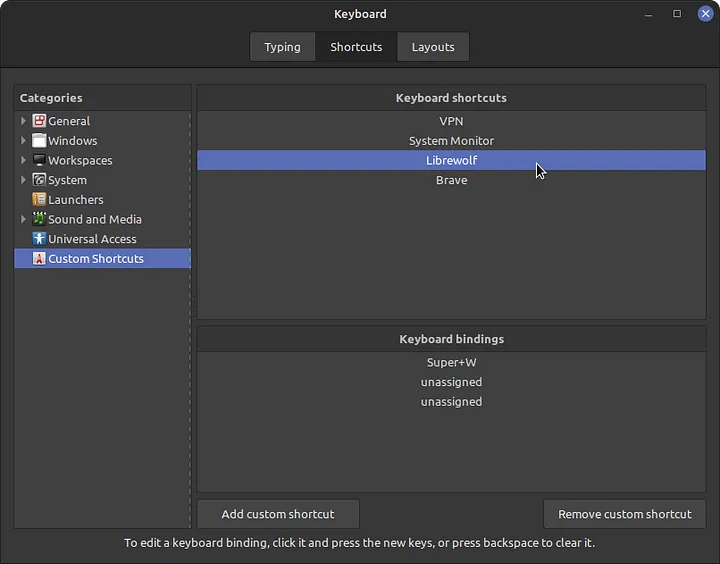
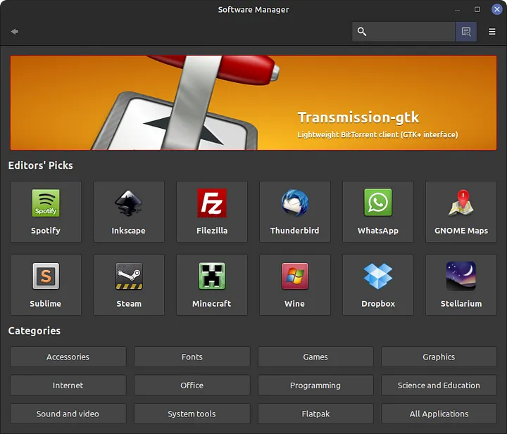
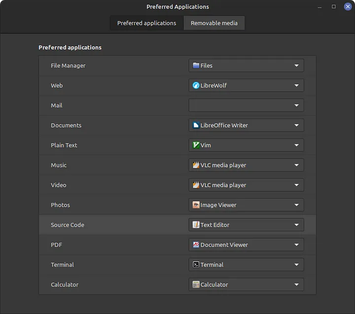
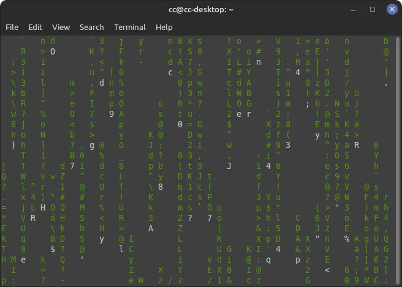
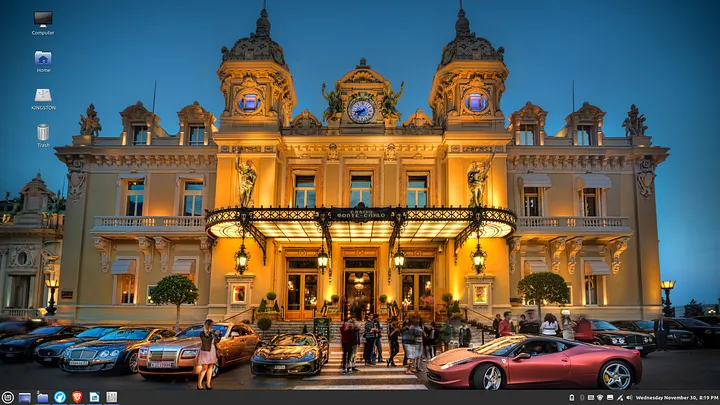
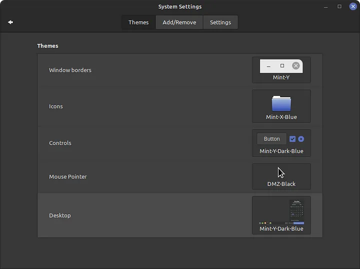
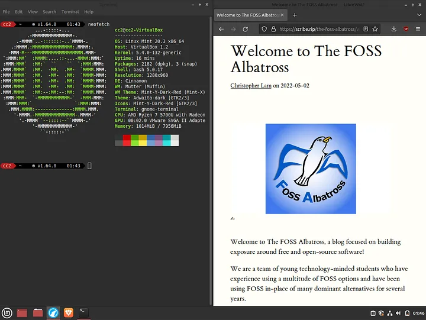
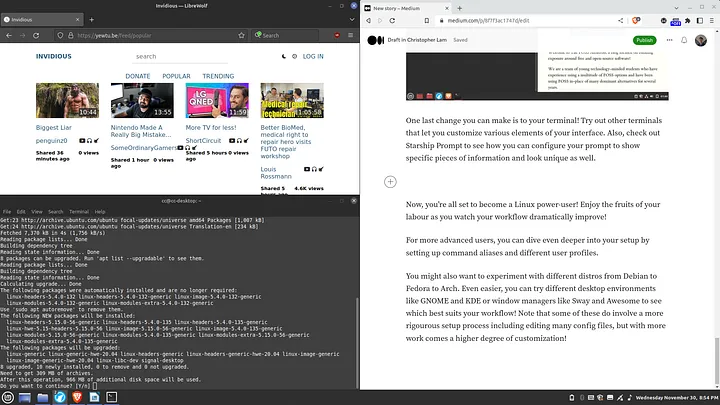
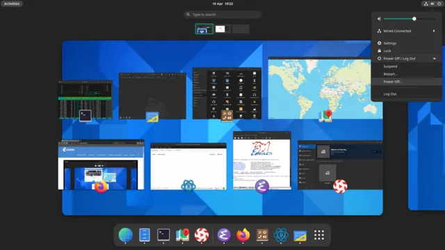
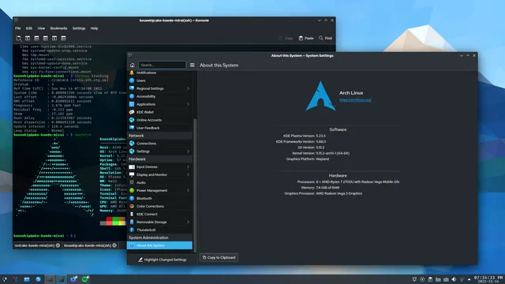

One of the biggest advantages of Linux over Windows or macOS is customization! But what’s the point of using Linux if you leave it as-is out-of-the-box? The process of customizing your Linux setup is a crucial step in your journey to becoming a power-user. Your tweaks can help make your Linux experience more efficient and of course make it truly your own.

There are countless ways to customize your Linux setup, but these three simple tweaks will make a world of difference. Let’s get started!

## Set Your Keybindings

The fastest way to work faster is to set keybindings! Having to move your mouse around or type long commands can be slow and tedious. Instead, automate the things you do often with keyboard shortcuts!

Try pressing Super+Enter for your terminal, Super+W for your web browser, and Super+N for your file manager. Feel free to experiment with different combinations as well – whatever suits you!

On most Linux distros, you can easily set your keybindings using the keyboard shortcuts menu. You can use the built in options or write your own custom commands!

Once you set your keybindings, you won’t remember how you worked without them!

## Install Your Favourite Tools

Most Linux distros come with a single default option for your basic programs. These options are not bad, but they might not be your favourites. Why settle for a suit off the rack when you can get it tailored?

Perhaps you have Firefox as your browser, Celluloid as your media player, and Nano as your text editor. Upgrade to LibreWolf, switch to VLC, and check out Vim! Look around in your software store and in forums for popular alternatives to try as well.

Don’t forget to install command line tools as well! Monitor your system with htop and use version control with git. Check out Rust alternatives to common commands like exa instead of ls and bat instead of cat. You can even play games like 2048 and pacman (pacman4console) and show a cool matrix effect with cmatrix!

## Make Your Interface Pretty

Just changing the appearance of your setup can seem superficial. But choose a look you like, and you’ll actually be excited to hop on your desktop to work! There are a plethora of tweaks you can make depending on your desktop environment or window manager.

Here are some ideas of pretty changes you can make! Try downloading new icons, cursors, fonts, and even entire themes. Change your accent colour and wallpaper. Don’t be afraid to change your workflow with modifications to your dock location and size.

One last change you can make is to your terminal! Try out other terminals that let you customize various elements of your interface. Also, check out Starship Prompt to see how you can configure your prompt to show specific pieces of information and look unique as well.

...

Now, you’re all set to become a Linux power-user! Enjoy the fruits of your labour as you watch your workflow dramatically improve!

For more advanced users, you can dive even deeper into your setup by setting up command aliases and different user profiles.

You might also want to experiment with different distros from Debian to Fedora to Arch.

GNOME on Fedora

KDE on Arch

Even easier, you can try different desktop environments like GNOME and KDE or window managers like Sway and Awesome to see which best suits your workflow!

Note that some of these do involve a more rigourous setup process including editing many config files, but with more work comes a higher degree of customization!
